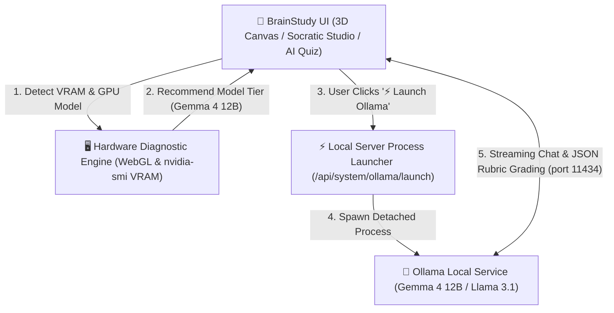

<div align="center">

# 🧠 BrainStudy

### Advanced 3D Neuroanatomy Laboratory & Local Socratic AI Studio

<br />

<a href="https://rorrimaesu.github.io/BrainStudy/" target="_blank">
  
</a>
&nbsp;&nbsp;
<a href="https://buymeacoffee.com/rorrimaesu" target="_blank">
  
</a>

<br /><br />

[](https://ollama.com)
&nbsp;
[](https://ollama.com)
&nbsp;
[](https://nodejs.org)
&nbsp;
[](https://nextjs.org)
&nbsp;
[](public/models/BIGBRAIN-LICENSE.txt)

---

<p align="center">
  <b>BrainStudy</b> is a desktop-class 3D neuroanatomy laboratory and Socratic AI learning studio. Powered by high-resolution cortical geometry from the <b>BigBrain Histological Project</b> and local LLM acceleration via <b>Ollama (Gemma 4 12B, Llama 3.1, Qwen)</b>, BrainStudy combines real-time 60FPS WebGL rendering with hardware-aware Socratic tutoring, adaptive short-answer rubric grading, and interactive clinical lesion localization.
</p>

</div>

---

> [!NOTE]
> **100% Local AI Privacy**: BrainStudy communicates with your local Ollama server (`http://127.0.0.1:11434`). No prompts, user data, or telemetry ever leave your device.

---

## 🏛️ System Architecture & Execution Flow



```
┌─────────────────────────────────────────────────────────────────────────┐
│                           BrainStudy Web UI                             │
│       (3D Anatomy Viewer / Socratic Drawer / AI Quiz / Clinical Case)   │
└────────────────────────────────────┬────────────────────────────────────┘
                                     │
           ┌─────────────────────────┴─────────────────────────┐
           │                                                   │
  [Client WebGL/WebGPU Diagnostic]                     [Local Server API Proxy]
  - UNMASKED_RENDERER_WEBGL                            - /api/system/gpu
  - Direct Ping (http://127.0.0.1:11434)               - /api/system/ollama/status
                                                       - /api/system/ollama/launch
                                                       - /api/system/ollama/chat
                                                       - /api/system/ollama/pull
                                                                   │
                                                                   ▼
                                                       [Host OS Hardware Bridge]
                                                       - nvidia-smi / powershell
                                                       - child_process.spawn()
                                                                   │
                                                                   ▼
                                                       [Local Ollama Instance]
                                                       (Gemma 4 12B / Gemma 4 e4b)
```

---

## ✨ Core Feature Highlights

### 🧠 3D Neuroanatomy Laboratory
* **BigBrain Histological Surface**: High-detail bilateral 3D cortical meshes preserving natural sulcal and gyral topography.
* **Multi-Layer Explorations**:
  * `01 Cortical Surface`: Gyri, sulci, and gross cerebral lobes.
  * `02 Deep Anatomy`: Subcortical nuclei, basal ganglia, limbic structures, and brainstem.
  * `03 Functional Circuits`: Animated neural information flow (sensory relays, motor tracts, limbic loops, and language networks).
* **Interactive Dissection & Planes**: L/R hemisphere isolation, medial separation, and live sagittal/coronal/axial section clipping.
* **Searchable Structure Index**: Filter over 30+ anatomical structures with dynamic 3D camera focusing.

### 🤖 Local AI & Gemma 4 Socratic Tutor ("Medulla AI")
* **Hardware GPU VRAM Auto-Detection**: WebGL/WebGPU diagnostic engine that probes your GPU renderer and physical VRAM to recommend the ideal local model tier:
  * **10–12 GB+ VRAM**: **Gemma 4 12B** (Optimal target for Socratic reasoning & multimodal anatomy)
  * **6–8 GB VRAM**: **Gemma 4 e4b** / Llama 3.1 8B (Compact balanced execution)
  * **< 6 GB VRAM**: **Gemma 4 e2b** / Llama 3.2 3B (Ultra-fast edge execution)
* **1-Click WebApp Process Launcher**: Launch your background Ollama server process straight from the web interface button (`⚡ Launch Ollama`).
* **1-Click Model Download Manager**: Stream model pulls directly in the UI with a real-time download progress bar.
* **Context-Aware Socratic Dialog**: Socratic tutor automatically syncs with the currently selected 3D brain region, neural connections, and clinical localization principles.
* **AI Short-Answer Rubric Grading**: Open-ended student question generator and 0–100 rubric grader utilizing native Ollama JSON Schemas to score accuracy, highlight missing points, and offer follow-up Socratic hints.
* **Clinical Case Simulator**: Diagnostic lesion scenarios that prompt students to identify the affected 3D structure on the brain canvas.

---

## 📊 Anatomy Layer & Provenance Matrix

| Layer Name | Provenance Grade | Primary Focus | Scientific Boundary / Limit |
|---|---|---|---|
| **`01 Cortical Surface`** | **Grade A (Atlas-Derived)** | Gyri, sulci, and gross cerebral lobes | Derived directly from the BigBrain 3D reconstruction. |
| **`02 Deep Anatomy`** | **Grade T (Teaching Model)** | Basal ganglia, limbic nuclei, brainstem | High-clarity spatial teaching reconstructions; non-patient specific. |
| **`03 Functional Circuits`** | **Grade C (Conceptual Network)**| Sensory, motor, limbic, & language flows | Animated schematic pathways communicating signal direction. |

---

## 📝 Example AI Socratic Rubric Evaluation Output

When submitting a short-answer response to Medulla AI, the local LLM evaluates your input using native Ollama JSON Schemas:

```json
{
  "score": 92,
  "grade": "Exemplary",
  "feedback": "Outstanding anatomical localization! You correctly identified Broca's area (inferior frontal gyrus, pars opercularis and triangularis) and its association with express motor speech deficits.",
  "strengths": [
    "Accurately specified Brodmann areas 44 and 45",
    "Linked lesion to expressive (non-fluent) aphasia"
  ],
  "missingPoints": [
    "Note the vascular supply via the superior division of the left Middle Cerebral Artery (MCA)"
  ],
  "socraticFollowup": "What contralateral motor signs might accompany this speech deficit if the motor strip is involved?"
}
```

---

## 🚀 Quick Start (Run Locally)

### Windows 1-Click Launch
1. Download or extract the repository folder into your environment (e.g. `D:\BrainStudy`).
2. Double-click **`START_BRAINSTUDY.bat`**.
3. On first run, it installs dependencies, starts the local laboratory server, and opens `http://127.0.0.1:5173` in your browser.

### Manual Setup (Terminal)
Ensure Node.js 22+ is installed, then run:

```powershell
npm install
npm run dev -- --host 127.0.0.1
```

Open your browser at `http://127.0.0.1:5173`.

### Connecting Ollama Local AI
1. Install [Ollama](https://ollama.com/download).
2. Click the top-bar badge in BrainStudy (**`⚡ Launch Ollama`**) or run in terminal:
   ```bash
   ollama pull gemma4:12b
   ```
3. Open **`🧠 Medulla AI Studio`** in BrainStudy to start your Socratic learning session!

---

## 🛠️ Troubleshooting & FAQ

<details>
<summary><b>Q: How do I launch Ollama if the badge shows "Ollama Stopped"?</b></summary>
<br />
Click the <b><code>⚡ Launch Ollama</code></b> button in the top header bar. BrainStudy's background process bridge (<code>/api/system/ollama/launch</code>) will automatically spawn the Ollama background service on your PC. Alternatively, run <code>ollama serve</code> in a terminal.
</details>

<details>
<summary><b>Q: Which local AI model should I use for my GPU?</b></summary>
<br />
BrainStudy automatically measures your GPU VRAM:
<ul>
  <li><b>12 GB+ VRAM</b>: Use <code>gemma4:12b</code> for best Socratic reasoning.</li>
  <li><b>8 GB VRAM</b>: Use <code>gemma4:e4b</code> or <code>llama3.1:8b</code>.</li>
  <li><b>4-6 GB VRAM</b>: Use <code>gemma4:e2b</code> or <code>llama3.2:3b</code>.</li>
</ul>
</details>

<details>
<summary><b>Q: Is my patient data or query sent to the cloud?</b></summary>
<br />
<b>No.</b> All AI processing is performed 100% locally on your computer via Ollama. No prompts or telemetry leave your machine.
</details>

---

## ⌨️ Controls & Keyboard Shortcuts

| Shortcut / Action | Function |
|---|---|
| **Left Click + Drag** | Orbit & rotate 3D brain canvas |
| **Mouse Wheel / Pinch** | Smooth zoom in / out |
| **`L` Key** | Cycle label density (`Off` ➔ `Focus` ➔ `Key` ➔ `All`) |
| **`R` Key** | Reset camera presets, section planes, and dissection sliders |
| **`Esc` Key** | Exit quiz mode or close active dialogs |

---

## 🔬 Academic Provenance & Transparency

* **Cortical Surface Mesh**: Adapted from the **BigBrain Project** 3D reconstructions and licensed under **CC BY-NC-SA 4.0**.
* **Provenance Classification**: Every layer explicitly disclaims its geometry level (*Atlas-Derived*, *Anatomical Teaching Model*, or *Conceptual Network*).
* **Scope Disclosures**: Models are designed for higher education concept learning and orientation. They are not intended for diagnostic interpretation, patient-specific stereotaxy, or surgical planning.

---

## ☕ Support the Project

If you find BrainStudy helpful for your neuroanatomy studies or research, consider supporting development!

<div align="center">

<a href="https://buymeacoffee.com/rorrimaesu" target="_blank">
  
</a>

<br /><br />
<small>Designed & Developed with ❤️ by <b>RorriMaesu</b></small>

</div>
